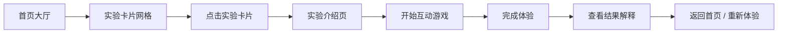

## 1. 产品概述

神经错觉博物馆是一个交互式科普网站，通过有趣的小游戏让用户亲身体验各种神经科学错觉现象，并在体验后提供专业的神经学原理解释。

- **目标用户**：对神经科学、心理学、认知科学感兴趣的普通大众和学生
- **核心价值**：寓教于乐，通过沉浸式体验让用户理解大脑的工作原理
- **产品定位**：科普教育类互动网站

## 2. 核心功能

### 2.1 用户角色

| 角色 | 注册方式 | 核心权限 |
|------|----------|----------|
| 访客用户 | 无需注册 | 浏览所有实验、参与互动游戏、查看解释 |

### 2.2 功能模块

1. **首页**：博物馆大厅、实验卡片网格、导航栏、页脚
2. **实验详情页**：实验介绍、互动小游戏、结果解释（现象、神经学原理、现实生活例子）

### 2.3 页面详情

| 页面名称 | 模块名称 | 功能描述 |
|----------|----------|----------|
| 首页 | 博物馆大厅 | 项目标题、副标题、引人入胜的视觉效果 |
| 首页 | 实验卡片网格 | 展示 5 个实验卡片，包含图标、标题、简介、进入按钮 |
| 首页 | 导航栏 | 网站标题、返回首页按钮 |
| 实验详情页 | 实验介绍 | 实验名称、简介、开始按钮 |
| 实验详情页 | 互动小游戏 | 可交互的错觉体验游戏 |
| 实验详情页 | 结果解释 | 分为三个板块：现象描述、神经学原理、现实生活例子 |
| 实验详情页 | 导航返回 | 返回首页、重新体验按钮 |

## 3. 核心流程

用户进入首页 → 浏览实验卡片 → 点击感兴趣的实验 → 阅读实验简介 → 开始互动体验 → 完成小游戏 → 查看结果解释（现象/原理/例子） → 返回首页或重新体验

## 4. 用户界面设计

### 4.1 设计风格

- **整体风格**：深邃神秘 + 未来科技感，营造大脑探索的氛围
- **主色调**：深靛蓝色（#1a1a3e）作为背景主色
- **辅助色**：霓虹紫（#9d4edd）、电光蓝（#00d4ff）、荧光粉（#ff006e）作为点缀
- **中性色**：深灰、银白用于文字
- **字体**：标题使用具有未来感的衬线/装饰字体，正文使用清晰易读的无衬线字体
- **布局风格**：卡片式布局，带有玻璃拟态（glassmorphism）效果
- **动效**：微妙的背景粒子动画、卡片悬浮效果、平滑过渡

### 4.2 页面设计概览

| 页面名称 | 模块名称 | UI 元素 |
|----------|----------|---------|
| 首页 | 大厅标题区 | 大标题、副标题、装饰性大脑图案、渐变背景 |
| 首页 | 实验卡片 | 图标、标题、简介标签、悬浮光效、玻璃拟态卡片 |
| 实验页 | 游戏区域 | 居中游戏画布、操作按钮、进度指示 |
| 实验页 | 解释区域 | 三段式卡片布局、图标引导、渐入动画 |

### 4.3 响应式

- 桌面端优先设计
- 移动端自适应：卡片从网格变为单列布局
- 触控优化：增大按钮点击区域

### 4.4 五个实验内容

1. **颜色错觉**：数方块颜色游戏 — 展示视觉系统如何预测信息
2. **运动错觉**：旋转蛇图 / 运动后效 — 展示运动感知的神经机制
3. **记忆错觉**：词语记忆测试 — 展示记忆的重构特性
4. **注意力盲区**：大猩猩实验 — 展示选择性注意
5. **时间感错觉**：时间估计小游戏 — 展示时间感知的可塑性
