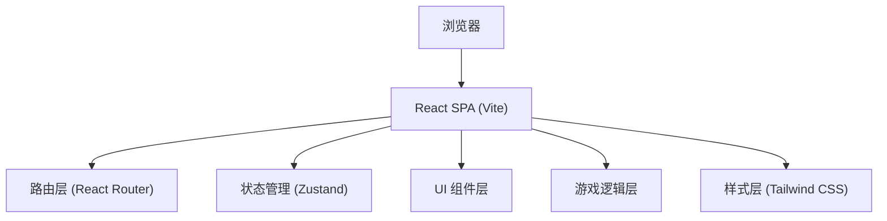

## 1. 架构设计

纯前端单页应用，所有数据和逻辑均在前端实现，无需后端服务。



## 2. 技术描述

- **前端框架**：React@18 + TypeScript
- **构建工具**：Vite@5
- **路由**：react-router-dom@6
- **状态管理**：zustand@4
- **样式方案**：Tailwind CSS@3
- **图标库**：lucide-react
- **后端**：无（纯前端应用）
- **数据**：静态 mock 数据（实验内容、解释文案）

## 3. 路由定义

| 路由 | 页面 | 目的 |
|------|------|------|
| `/` | 首页 | 博物馆大厅，展示所有实验卡片 |
| `/experiment/:id` | 实验详情页 | 展示特定实验的介绍、游戏和解释 |

## 4. 项目结构

```
src/
├── components/         # 可复用组件
│   ├── Navbar.tsx      # 导航栏
│   ├── ExperimentCard.tsx  # 实验卡片
│   ├── ExplanationCard.tsx # 解释卡片
│   └── ...
├── pages/              # 页面组件
│   ├── Home.tsx        # 首页
│   └── Experiment.tsx  # 实验详情页
├── experiments/        # 实验游戏组件
│   ├── ColorIllusion.tsx    # 颜色错觉
│   ├── MotionIllusion.tsx   # 运动错觉
│   ├── MemoryIllusion.tsx   # 记忆错觉
│   ├── AttentionBlindspot.tsx # 注意力盲区
│   └── TimeIllusion.tsx     # 时间感错觉
├── data/               # 实验数据和内容
│   └── experiments.ts  # 实验元数据和解释文案
├── hooks/              # 自定义 hooks
├── utils/              # 工具函数
├── App.tsx             # 根组件
├── main.tsx            # 入口文件
└── index.css           # 全局样式
```

## 5. 数据模型

### 实验数据模型

```typescript
interface Experiment {
  id: string;
  title: string;
  shortDescription: string;
  icon: string;
  accentColor: string;
  introduction: string;
  phenomenon: string;
  neurosciencePrinciple: string;
  realLifeExamples: string[];
}
```

### 游戏状态模型

```typescript
type GamePhase = 'intro' | 'playing' | 'result';

interface GameState {
  phase: GamePhase;
  score?: number;
  // 各实验特定状态
}
```

## 6. 状态管理

使用 zustand 管理全局 UI 状态，各实验游戏内部使用 React useState/useReducer 管理自身状态。

```typescript
// 全局 UI store
const useUIStore = create((set) => ({
  currentExperiment: null,
  // ...
}));
```
